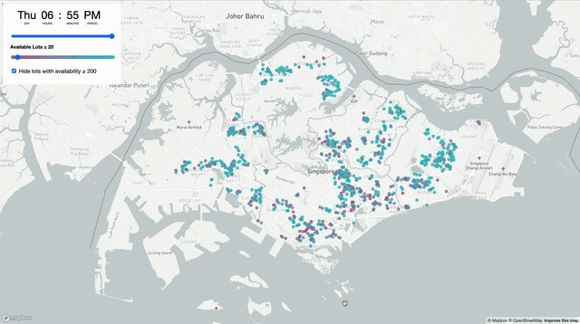
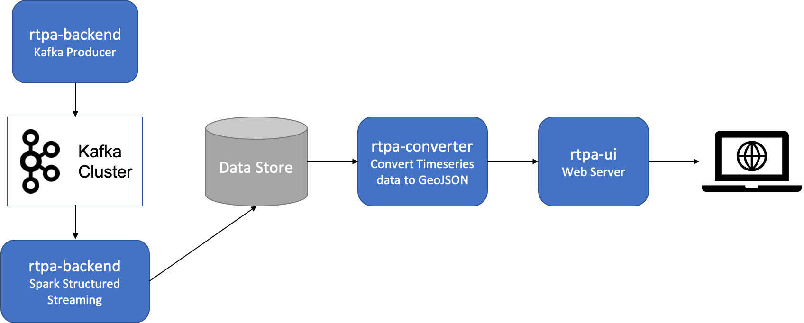

# RTPA - Real-Time Parking Availability

RTPA is a real-time application that fetches the availability of parking lots in Singapore and displays it on an interactive map.



---
## High Lvel Architecture



---
## Pre-requisites

### 1. LTA DataMall Account
This repo uses real-time data provided by `LTA Data Mall`. In order to run the code, you will need to [request](https://www.mytransport.sg/content/mytransport/home/dataMall/request-for-api.html) an `AccountKey`.

### 2. Running Kafka and Zookeeper Images

This project requires a Kafka cluster to produce / consume data from. [docker-compose-kafka.yml](docker-compose-kafka.yml) provides an easy way to set up a cluster using the following bitnami docker images.
1. **bitnami-kafka**
2. **bitnami-zookeeper**

```sh
docker-compose -f docker-compose-kafka.yml up -d
```

### 3. Creating a topic in Kafka
Since bitnami kafka image doesn't provide a way to create topics on start up, we have to start zookeeper and kafka first and manually create the topic.


Create a topic called rtpa used by rtpa-backend
```sh
docker container exec -it rtpa_kafka_1 /bin/bash

/opt/bitnami/kafka/bin/kafka-topics.sh --list --zookeeper zookeeper:2181 

/opt/bitnami/kafka/bin/kafka-topics.sh --create --zookeeper zookeeper:2181 --topic rtpa --replication-factor 1 --partitions 1
```

---

## RTPA Docker Images

## Building images

In order to build the images, you will need the following developer tools installed.
- scala 2.12.x
- node 12.x

Alternativelt, you can get the pre-built images from the [Docker Hub](https://hub.docker.com/repository/docker/waiyan1612/rtpa).

```sh
./docker-build.sh
```
This will build the following docker images.
1. **rtpa-backend** - Kafka Producer + Spark Consumer
2. **rtpa-converter** - NodeJS App that converts time series data to GeoJSON
3. **rtpa-ui** - Mapbox JS based HTML served from Nginx server

## Running images
1. Modify the environment variables and volume mounts (optional) in [docker-compose.yml](docker-compose.yml) or [docker-compose-local.yml](docker-compose-local.yml).
    - `DATAMALL_API_KEY` - Required. `AccountKey` provided by LTA Datamall
    - `RTPA_CSV_PATH` - Optional. Directory containing CSV carpack data, produced by rtpa-backend and consumed by rtpa-converter
    - `RTPA_GEOJSON_PATH` - Optional. Directory containing geojson carpack data, produced by rtpa-converter and consumed by rtpa-ui
    - `PRODUCER_TRIGGER_INTERVAL_MINUTES` - Optional. Determines how often the producer calls the DataMall APIs and writes to the Kafka topic
    - `CONSUMER_TRIGGER_INTERVAL_MINUTES` - Optional. Determines how often the consumers reads the data from Kafka topic
    
2. Run the docker images.
    ```sh
    docker-compose up -d
    ```
    Or if using the local build,

    ```sh
    docker-compose -f docker-compose-local.yml 
    ```

3. The web application is now LIVE at http://localhost. You may need to wait a few minutes for the first batch of data to come through depending on your `PRODUCER_TRIGGER_INTERVAL_MINUTES` and `CONSUMER_TRIGGER_INTERVAL_MINUTES` settings.
